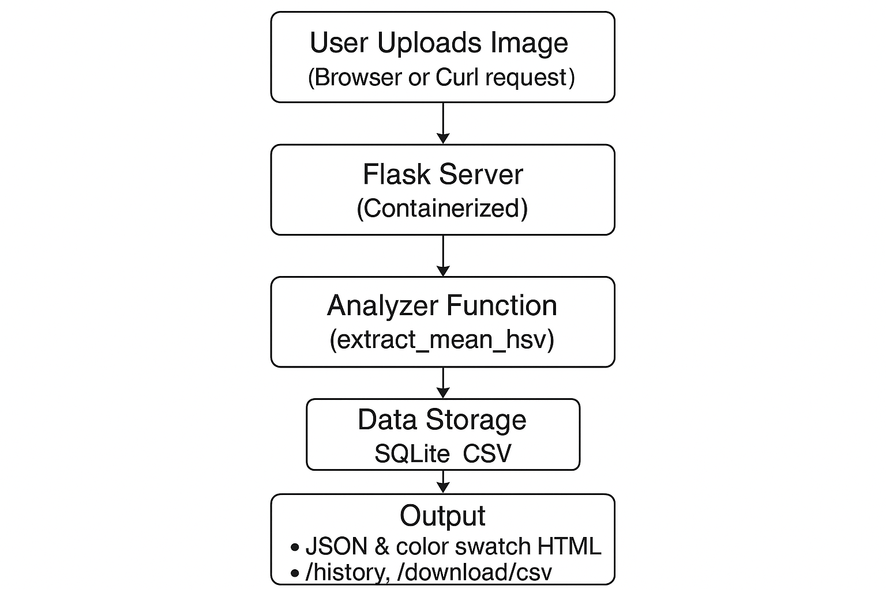

## 1) Executive Summary

**Problem:**
Designers, developers, and data analysts often want to quickly understand the dominant or average color of an image — whether for design choices, UI theming, or analyzing color balance. Manually checking in image editors is tedious and inconsistent.

**Solution:**
The Image Color Extractor is a lightweight Flask web app that lets users upload an image and instantly view its average color in RGB, HSV, and HEX formats — complete with a visual color swatch. The app is fully containerized with Docker for reproducibility and includes persistent storage (SQLite + CSV) so every uploaded image’s results are saved and viewable later through a /history endpoint.

## 2) System Overview

**Course Concept(s):**

- Flask API development for serving analytical functionality through HTTP endpoints.

- Containerization with Docker for reproducible, environment-independent execution.

- Lightweight data persistence using SQLite + CSV logging for minimal state management.

**Architecture Diagram:**

**Data / Models / Services:**

Input: Any Pillow-supported image (e.g., .jpg, .png).

Computation: Image is converted to an RGB array using NumPy, the mean RGB vector is computed, and converted to HSV + HEX via colorsys.

Storage: Results are logged to an SQLite database (assets/results.db) and a CSV file (assets/results.csv).

Endpoints:

- / → upload form

- /analyze → computes and returns average color

- /history → returns last 50 analyses (JSON)

- /download/csv → exports CSV log

- /health → simple health check

## 3) How to Run (Local)
**Docker**

/# build

docker build -t image-color-extractor:latest .

/# run

docker run --rm -p 5000:5000 -v "$(pwd)/assets:/app/assets" image-color-extractor:latest

/# health check (optional)

curl http://localhost:5000/health

Then open http://localhost:5000
 to upload an image.

The containerized version will automatically initialize the SQLite database and store all uploaded image results inside /app/assets.

## 4) Design Decisions

**Why this concept?**
I chose Flask + Docker because they demonstrate practical web deployment and reproducibility — key course concepts — while keeping the core logic simple and visual. Image color analysis is intuitive, allowing me to focus on architecture and containerization rather than complex modeling.

**Tradeoffs:**

- Simple average color ≠ full color distribution — trades precision for clarity and speed.

- Storing results in SQLite/CSV is lightweight but not scalable for high concurrency.

**Security / Privacy:**

- Uploaded images are processed in-memory and never stored permanently.

- No user data or external APIs are used, so privacy risk is minimal.

- .env.example documents environment variables without hard-coding secrets.

**Ops:**

- All configuration is environment-driven (PORT, DB_PATH, etc.).

- Logs automatically print via Flask to container stdout.

- The assets folder is mountable so data persists across runs.

## 5) Results & Evaluation

**Sample Output (JSON):**

{
  "filename": "example.jpg",
  "result": {
    "mean_rgb": {"r": 114.1, "g": 161.2, "b": 222.0},
    "mean_hsv": {"h_degrees": 215.6, "s": 0.49, "v": 0.87},
    "hex": "#72a1de"
  }
}

**Visual Output (Web UI):**
When an image is uploaded, the app displays:

- A color swatch representing the average color

- Average RGB, HSV, and HEX values

Performance / Footprint:

- Processes 1 MB images in < 1 second.

- Memory footprint under 100 MB RAM when containerized.

Validation / Tests:

- /health endpoint returns status 200 OK

- pytest smoke test confirms startup

- Manual verification of /history persistence

## 6) What’s Next

- Add color-palette extraction using k-means clustering (top N dominant colors).

- Include drag-and-drop front-end preview and HEX-to-RGB converter.

- Optionally deploy to a free cloud service (Render / Railway) with persistent volume.

## 7) Links (Required)

GitHub Repo: https://github.com/dfu5sm/FinalCase.git
